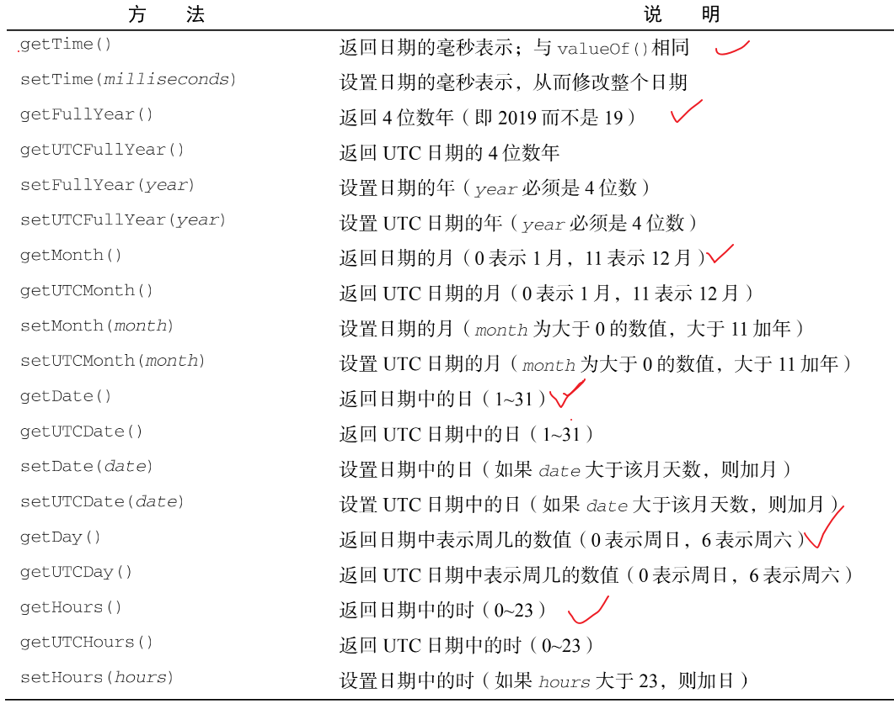

### Date
创建日期对象，使用new操作符调用Date构造函数：
let now  = new Date()

Date类型的方法


### RegExp
```javascript
let expression = /pattern/flags
```
这个正则表达式的pattern（模式）可以是任何简单或复杂的正则表达式。

正则的匹配模式的标记
 - g：全局模式，表示查找字符串的全部内容，而不是找到第一个匹配的内容就结束
 - i：不区分大小写，表示查找匹配时忽略pattern和字符串的大小写
 - m：多行模式，表示找到一行文本末尾时会继续查找
 - y: 粘附模式，表示只查找从lastIndex开始及之后的字符串

 检测正则表达式是否匹配的方法 test()，如果输入的文本与模式匹配，则参数返回true

 ```javascript
 let text = 'hello world'
 let pattern = /H/i  
 if(pattern.test(text)){ 
    // 如果text中有h或者H 则执行
    console.log(1) // 1
 }
 ```