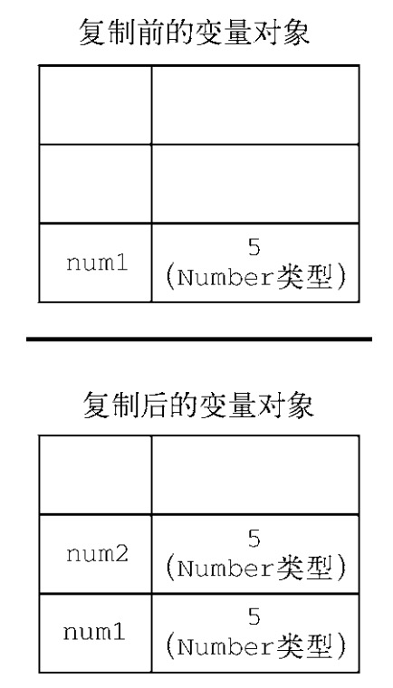
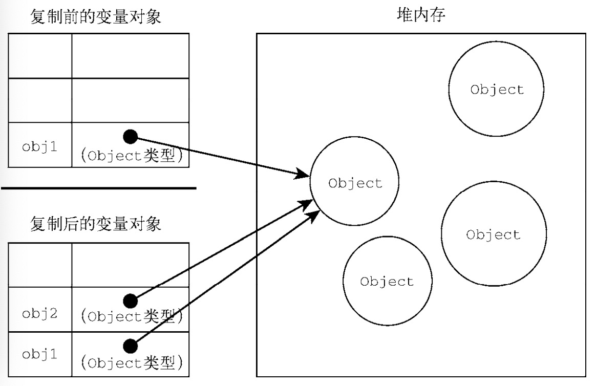

### 基本类型和引用类型

### js堆栈概念

- js变量都存放在内存中，而内存给变量开辟了两块区域，分别为栈区域和堆区域
- 栈像个容器，容量小速度快
- 堆像个房间，容量较大

### 基础类型值存储

- 基本数据类型的值，占据固定大小的空间，保存栈内存中
- 栈遵从后进先出：声明一个变量，多次赋值取最后一个值

```javascript
var num = 10
num = 15
num = 20
console.log(num) // 20

var num2 = num
console.log(num2 === num1) // true

num2 = 30
console.log(num2 === num1) // false
```
### 引用类型值存储

- 引用类型（Object）的值是对象，保存在堆内存中

```javascript
var cat1 = {
    name: 'shiYi',
    age: 1
}
var cat2 = cat1
cat2.name = 'shiEr'
console.log(cat1.name) // shiEr
```
### 动态属性
引用值而言，可以随时添加、修改和删除其属性和方法。

```javascript
let person = {}; 
person.name = "Nicholas"; 
console.log(person.name); // "Nicholas"
```

原始值不能有属性，尽管尝试给原始值添加属性不会报错。

```javascript
let name = "Nicholas"; 
name.age = 27; 
console.log(name.age); // undefined
```
### 复制值
除了存储方式不同，原始值和引用值在通过变量复制时也有所不同。

- 原始值的复制会开辟一个新的空间，原始值会被复制到新变量的位置。

- 而把引用值的复制只是复制了一个指针，新旧指针都指向存储在堆内存中的对象。


### 判断类型
typeof 操作符最适合用来判断一个变量是否为字符串、数值、布尔值或 undefined 。但是如果值是对象或 null，那么 typeof 返回的是object

判断`Object`，`Array`，`null`的可以适应instanceof进行判断
```javascript
console.log(person instanceof Object); // 变量 person 是 Object 吗？
console.log(colors instanceof Array); // 变量 colors 是 Array 吗？
console.log(pattern instanceof RegExp); // 变量 pattern 是 RegExp 吗？
```
但是instance并不准确，思考题： [请说出三种判断是否是数组的方法？](./isArray.md)
